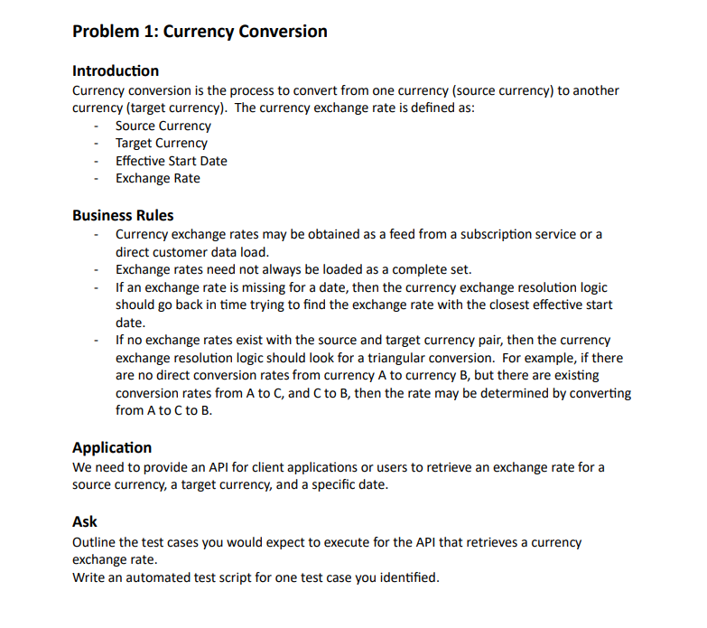
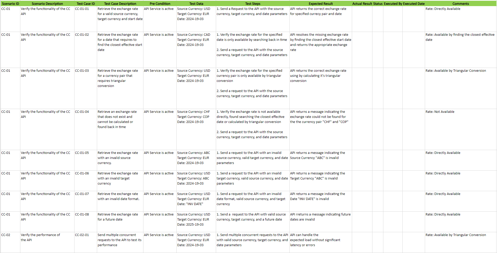

## Test Case representation for a currency exchange api scenario





## API Testing

### Getting Started Demoblaze

[Currency Exchange](https://rapidapi.com/airaudoeduardo/api/currency-converter241/) is a currency exchange rate testing server with support for REST API, the selected scenario was fulfilled using JS and Cypress:

- get a currency exchange rate from UYU to USD

### Project Prerequisites

NodeJS v^20.1\*
Cypress v^13.6

```
npm install
```

### Project Commands

Run API test command

```
npm run test:currencyExchange
```
